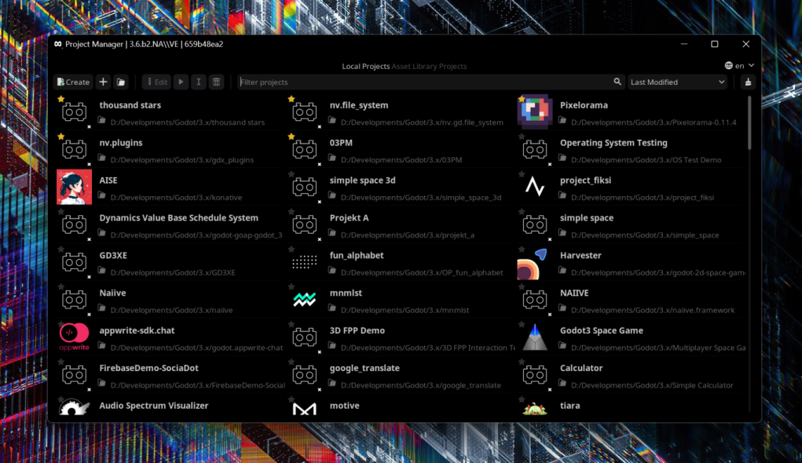

# GDX

  

custom version of the [**Godot Engine 3.x branch**](https://github.com/godotengine/godot/tree/3.x), For more information on modifications, check [**This Changelogs**](GDX_CHANGELOG.md).

## Screenshots

screenshots is using assets below :

- File System https://github.com/naiiveprojects/nv.gd.file_system
- Node Pivot https://github.com/naiiveprojects/gd.node_pivot
- Custom Borderless `comming soon`
- Background https://twitter.com/Ry_Hawthorne

## Installation

> [!CAUTION]
> this is a *bleeding-edge* build. backing up your projects or utilizing version control systems like Git is highly recommended.

---

     

